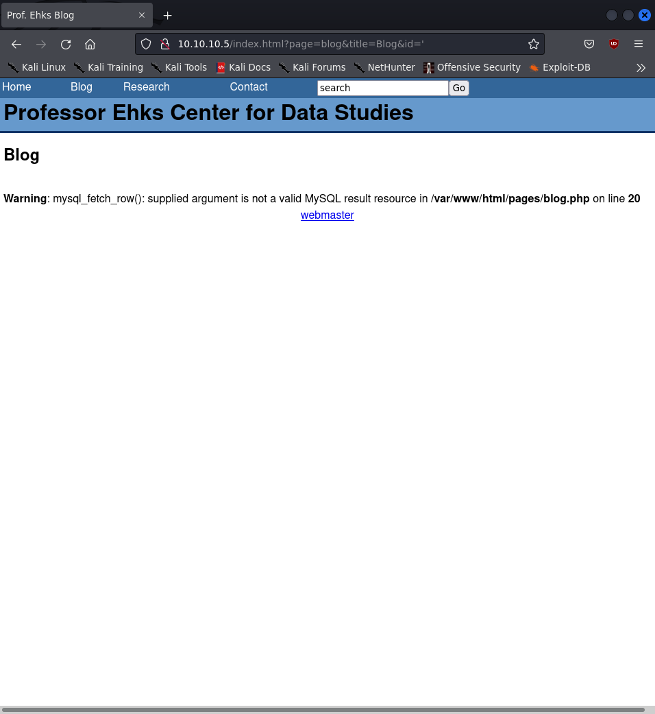
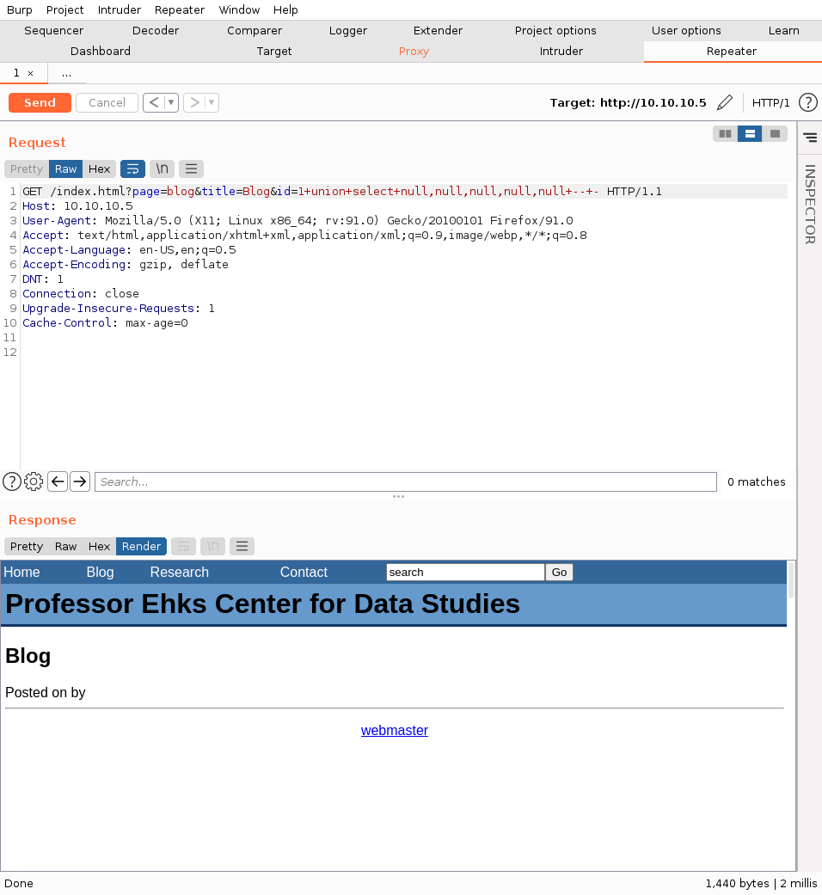
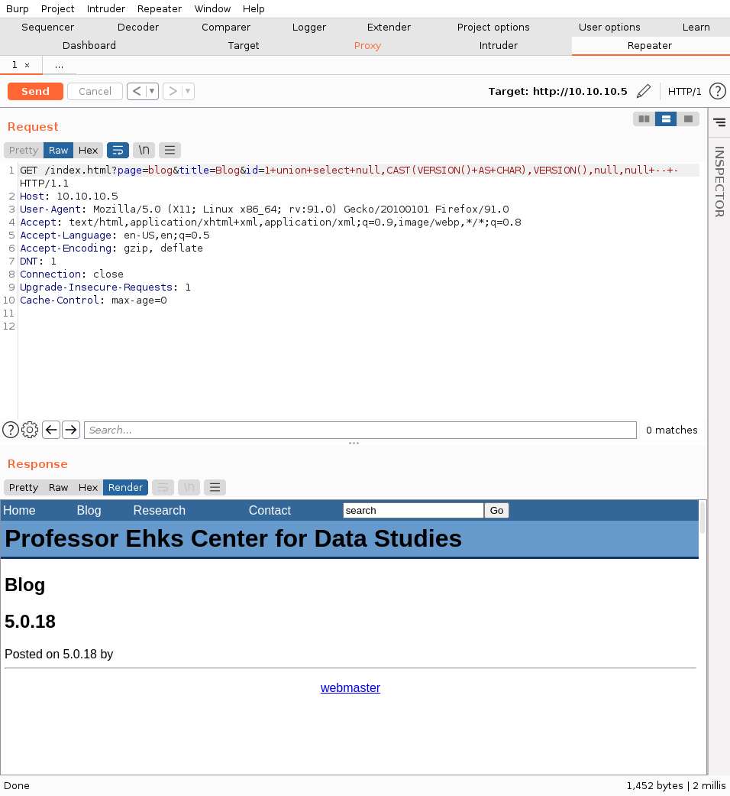
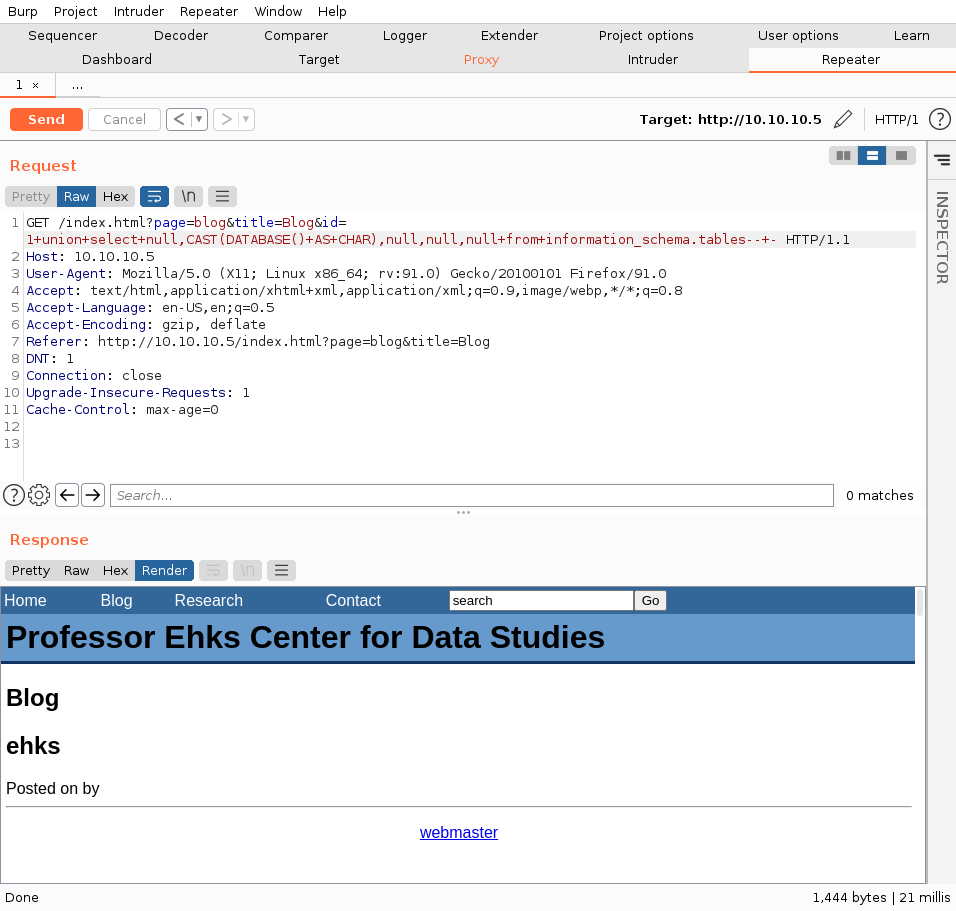
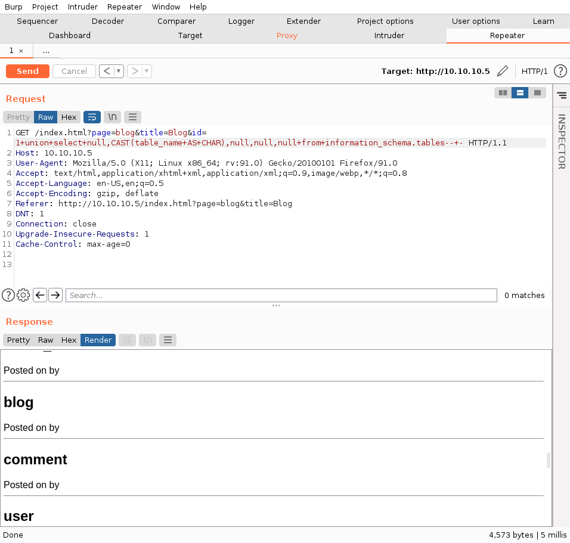
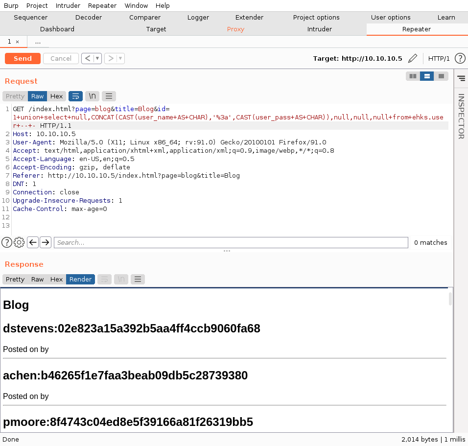

# LampSecurity CTF3 by MadIrish2600

- attacker IP : `10.10.10.4`
- lampCTF3 IP : `10.10.10.5`

# Reconnaissance

The room is themed lamp, which stands for linux+apache+mysql+php architecture. Hence we expect to exploit SQL injections and XSS (and eventually more).

## nmap

A quick nmap scan shows us some open ports :

- `22` with OpenSSH 4.3 (ssh)
- `25` with Sendmail 8.13.5 (smtp)
- `80` with Apache httpd 2.2.0 (http)

## robots.txt

Checking the `robots.txt` file on the web server lets us discover a few hidden directories :

- `/mail/`
- `/restricted/`
- `/conf/`
- `/sql/`
- `/admin/`

## SQL-injectable parameters

In the blog section, we find that the GET parameter `id` is injectable by merely remplacing the number with a simple quote. The website transparently shows the error message so we can ensure that the dbms is MySQL :

# Exploitation

## UNION based MySQL injection

Our objective now is to dump the whole database and get the credentials of every user.

Assuming that the request has the following structure, we will try to append arbitrary data to the results thanks to the `UNION` SQL keyword :

`SELECT id,title,date,content,author from ehks.blog where id={injectable section} and [...]`

### Identifying the number of columns

We stated previously that the request has five columns (id, title, etc.) which is an information that we infered from the page's structure, however we have to ascertain it in order to be able to inject our arbitrary request.

Thus we use the following payload in the `id` field : `1+union+select+null+--+-`

We get this result : 

Which means that there is more than one column in the SQL request inside the website's PHP source code. We increase the number of `null` in our `SELECT` statement until we stop getting error messages.

We get an empty blog post page with 5 `null` which means that the base request has 5 columns :

### Identifying the string columns

Now, since we want to print credentials, we have to identify `string` columns through which we can print arbitrary data inside the blog post structure of the web page.

The method is to substitute simple strings such as `'a'` for the `null`s in our request :

We conclude that the four last columns are of type `string`. I will be using the second one to print database data.

### Printing DBMS Version

In order to tailor well our payloads, it is better to know the MySQL version used by the server.
There are indirects means that can be used to make a close guess but here we will be getting it directly since there are functions like `VERSION()` that can be inserted inside a `SELECT` statement in order to output DBMS informations.

We get the following result using the payload `1+union+select+null,CAST(VERSION()+AS+CHAR),VERSION(),null,null+--+-` :

We conclude that MySQL version 5.0.18 is being used. We can also notice a strange behaviour we have to cast the type to `CHAR` in the second column otherwise we get an error however it is not necessary in the third one.

### Printing databases

Through an analog process, we print the available databases using the `DATABASE()` function :

The database has the same name as the webmaster, ehks.

### Printing tables

Now we want to print the tables contained in the `ehks` database. To do so, we will use the `information_schema` standard database of MySQL.

By using the following payload and getting no error, we can ensure that the table `information_schema.tables` exists on the database :

Then we print the `table_name` column :

I showed on the screenshot the database that may contain sensitive data but we could isolate the ehks database beforehand using this payload : `1+union+select+null,CAST(table_name+AS+CHAR),null,null,null+from+information_schema.tables+where+CAST(table_schema+AS+CHAR)+in+(0x65686b73)--+-`

I had to use the little trick to hex-encode the name of the database (`ehks`) otherwise I'd get an error.

### Printing columns

Now we will print the names of columns of the tables from which we will extract data. This information can be found in the `information_schema.columns` table.

Payload : `1+union+select+null,CONCAT(CAST(table_name+AS+CHAR),'%3a',CAST(column_name+AS+CHAR)),null,null,null+from+information_schema.columns+where+CAST(table_schema+AS+CHAR)+in+(0x65686b73)--+-`

### Printing data

Our job is almost done. We will print the columns `user_name` and ̀`user_pass` from the `ehks.user` table :

We now have the MD5 hashes of all the passwords, that of course, appear in [crackstation](https://crackstation.net)'s wordlist :

# Connecting through SSH

Now that we have the credentials, we want to ssh into the machine but we get the following error :

 `Unable to negotiate with 10.10.10.5 port 22: no matching key exchange method found. Their offer: diffie-hellman-group-exchange-sha1,diffie-hellman-group14-sha1,diffie-hellman-group1-sha1`

We have to use the following option to connect accordingly : `-oKexAlgorithms=+diffie-hellman-group1-sha1`

Then, using ̀`dstevens`'s credential, we can `sudo su` and become `root` in the machine :

